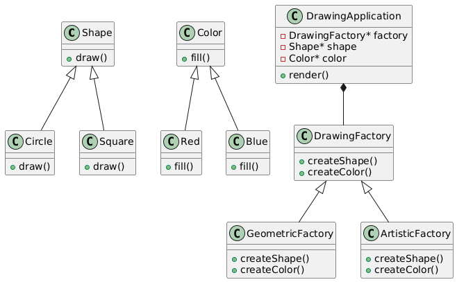

## UML Diagram



# Drawing Application with Abstract Factory Pattern (C++)

This task implements a Drawing Application based on the provided UML diagram.

The design uses abstract base classes, inheritance, composition, and the Abstract Factory Pattern to create related drawing objects such as shapes and colors.

---

## Objective

Implement the classes shown in the UML diagram:

- Shape
- Circle
- Square
- Color
- Red
- Blue
- DrawingFactory
- GeometricFactory
- ArtisticFactory
- DrawingApplication

---

## Class Responsibilities

### Shape
Base class for drawable objects.

Expected method:
```cpp
draw()
Circle and Square

Concrete shape classes that inherit from Shape.

Each class should override:

draw()
Color

Base class for color behavior.

Expected method:

fill()
Red and Blue

Concrete color classes that inherit from Color.

Each class should override:

fill()
DrawingFactory

Abstract factory class responsible for creating related objects.

Expected methods:

createShape()
createColor()
GeometricFactory

Concrete factory that creates one family of shape/color objects.

Expected methods:

createShape()
createColor()
ArtisticFactory

Concrete factory that creates another family of shape/color objects.

Expected methods:

createShape()
createColor()
DrawingApplication

Application class that uses composition.

It should contain:

DrawingFactory* factory
Shape* shape
Color* color

Expected method:

render()
Design Focus

This task emphasizes:

Abstract classes
Inheritance
Polymorphism
Composition
Abstract Factory Pattern
UML-to-code implementation
Expected Outcome

After implementation, the program should:

Create shapes and colors through factory classes
Render objects without depending directly on concrete classes
Demonstrate polymorphic behavior through overridden methods
Follow the structure shown in the UML diagram
Key Concepts
Abstract Factory Pattern
Interface-based programming
Decoupling object creation from object usage
Runtime polymorphism
Object composition
Build and Run
g++ -std=c++17 oop/drawing_application_abstract_factory/main.cpp -o drawing_app
./drawing_app
Notes
This task belongs under OOP.
Follow the UML diagram closely.
The DrawingApplication should depend on abstractions, not concrete classes.
Factories should control object creation.